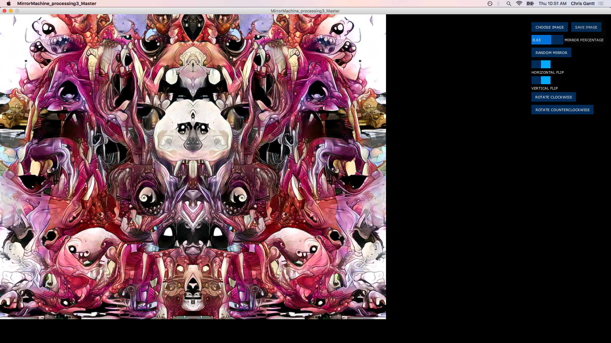

# MirrorMachine
 This program was designed to randomly take a section of an image, rotate it, and mirror it across the y-axis to create a new symmetrical design. With a built-in gui, controlP5, Mirror Machine allows you to change the rotation and the percent of the image that is mirrored in real time.
